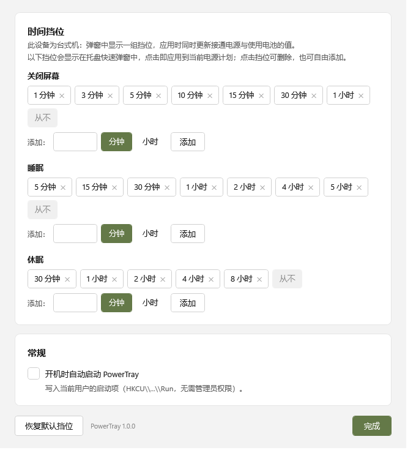

# PowerTray

[](https://github.com/moesnow/PowerTray/actions/workflows/ci.yml)
[](https://github.com/moesnow/PowerTray/releases/latest)
[](https://github.com/moesnow/PowerTray/releases)
[](https://www.gnu.org/licenses/gpl-3.0)

一款常驻 Windows 托盘区的电源超时快捷设置小工具：左键一点即可修改「关闭屏幕 / 睡眠 / 休眠」的时间，界面与 Windows 11 原生风格保持一致，并自动跟随系统的深色 / 浅色模式。

## 界面预览

| 快速弹窗（左键托盘图标） | 设置（托盘右键 → 设置） |
| :---: | :---: |
|  |  |

> 界面使用系统强调色，并随系统深色 / 浅色模式自动切换。

## 下载安装

到 [Releases](https://github.com/moesnow/PowerTray/releases/latest) 下载：

- **`PowerTray-Setup-x.y.z.exe`** — 安装包：当前用户免管理员安装，含开始菜单快捷方式、卸载器，可选开机自启；
- **`PowerTray-x.y.z-win-x64.zip`** — 绿色便携版：解压后直接运行 `PowerTray.exe`，无需安装。

运行后程序常驻托盘区（如托盘图标过多，请在「编辑托盘图标」中将其拖出）。

## 功能

- **无主界面启动**：启动后仅在托盘区显示图标，不出现任何窗口。
- **左键点击图标** → 弹出快速设置面板：
  - 「关闭屏幕」「睡眠」「休眠」三组时间挡位，**点击即写入系统并立即生效**，面板保持打开，可连续调整；
  - 面板右侧实时显示当前生效值；
  - **点击面板空白处 / 面板外任意位置 / Esc** 关闭面板；再次点击托盘图标也会收起。
- **右键点击图标** → 菜单：`设置` / `退出`。
- **电源场景自适应**：
  - 台式机：只显示一组挡位，应用时同时更新「接通电源」和「使用电池」两套值；
  - 笔记本（检测到电池）：面板顶部提供 `接通电源 / 使用电池` 切换，挡位分别写入对应值。
- **设备能力感知**：
  - 设备未启用休眠（hiberfil.sys 不存在）→ 面板中不显示「休眠」，设置页保留该项并给出提示；
  - 设备不支持睡眠 → 「睡眠」同理；
  - 「关闭屏幕」始终显示。
- **设置页**（原生标题栏 + Fluent 卡片布局）：
  - 自定义三类时间挡位（点击挡位删除、输入数值添加，单位可选 分钟 / 小时，固定提供「从不」）；
  - 开机自启动开关（写入 `HKCU\...\Run`，无需管理员权限）；
  - 「恢复默认挡位」一键还原。
- **视觉**：Windows 11 Fluent 风格（圆角、Segoe UI Variable、系统强调色、细滚动条），**深色 / 浅色模式跟随系统自动切换**（含托盘图标颜色、窗口标题栏深色模式）。
- 修改仅作用于**当前活动电源计划**，与 Windows「设置」App 行为一致。

## 运行要求

- Windows 11（Windows 10 理论可用，视觉未做适配），x64。
- 普通用户权限即可（仅启用 / 关闭系统休眠功能时才需要管理员，本工具不主动修改休眠开关）。

## 目录结构

```
PowerTray.sln
build.ps1                     一键构建（图标 → publish → 安装包）
tools/Generate-Icon.ps1       生成多尺寸应用图标 app.ico
installer/PowerTray.iss       Inno Setup 安装包脚本（当前用户安装，免管理员）
tests/PowerTray.CoreTest/     电源读写功能自测（命令行，含 powercfg 交叉核对）
src/PowerTray/
  App.xaml(.cs)               托盘图标、右键菜单、弹窗/设置窗口调度
  Native/                     powrprof / user32 / dwmapi 互操作
  Native/PowerManager.cs      屏幕/睡眠/休眠超时读写 + 设备能力探测
  Services/SettingsStore.cs   挡位配置（%AppData%\PowerTray\settings.json）
  Services/AutoStartService.cs开机自启动（HKCU Run）
  Theme/                      Light.xaml / Dark.xaml / Controls.xaml / ThemeManager.cs
  Views/QuickPopup.xaml       托盘快速设置面板
  Views/SettingsWindow.xaml   设置窗口
  Utils/                      图标绘制、任务栏定位、时间格式化
```

## 构建

前置：.NET 8 SDK、Inno Setup 6（仅打包需要）。

```powershell
# 一键构建：图标 → dotnet publish → dist\PowerTray-Setup-1.0.0.exe
.\build.ps1

# 指定版本号（写入程序集与安装包文件名）
.\build.ps1 -Version 1.2.3

# 只要可执行文件（绿色目录 dist\publish\PowerTray.exe）
.\build.ps1 -SkipInstaller

# 构建后立即试运行
.\build.ps1 -SkipInstaller -Run
```

也可以直接用 IDE 打开 `PowerTray.sln` 调试运行。

## 持续集成 / 发布

- **CI**（`.github/workflows/ci.yml`）：push / PR 时在 `windows-latest` 上构建，跑电源读写自测与应用自检，并上传界面截图作为构建产物。
- **Release**（`.github/workflows/release.yml`）：推送 `v*` 标签（如 `v1.0.0`）后自动构建安装包 + 绿色便携版 zip，并创建 GitHub Release 上传资产。

```powershell
# 发布新版本
git tag -a v1.2.3 -m "PowerTray v1.2.3"
git push origin v1.2.3
```

## 使用说明

- **弹窗挡位**：点击即生效（对应 Windows 电源计划里的「在此时间无操作后关闭显示器 / 进入睡眠 / 进入休眠」），`0 = 从不`。
- **「从不」是固定挡位**，不可删除；其余挡位均可自由增删，保存在配置文件中。
- **开机自启动**：设置页勾选，写入 `HKCU\Software\Microsoft\Windows\CurrentVersion\Run`；安装时也可在安装向导中勾选。
- **命令行**：`PowerTray.exe --settings` 启动并直接打开设置窗口（安装包提供的「PowerTray 设置」快捷方式使用该参数）。
- **配置文件**：`%AppData%\PowerTray\settings.json`（删除后自动恢复默认挡位）。
- **单实例**：重复启动会自动退出，不会出现多个托盘图标。

## 自测

```powershell
# 电源读写功能自测：能力探测、写入 300 秒读回验证、还原，并打印 powercfg 原始输出核对 GUID
dotnet run --project .\tests\PowerTray.CoreTest

# 应用自检：自动打开弹窗 / 设置窗口 / 托盘菜单，
# 输出报告到 %TEMP%\powertray-selftest.txt，并把三个界面渲染成截图
# %TEMP%\powertray-popup.png / powertray-settings.png / powertray-menu.png
.\src\PowerTray\bin\Debug\net8.0-windows\PowerTray.exe --selftest

# 测试用：环境变量 POWERTRAY_THEME=light|dark 可强制指定主题（不影响系统设置）
$env:POWERTRAY_THEME = 'light'; .\src\PowerTray\bin\Debug\net8.0-windows\PowerTray.exe --selftest
```

运行期异常会追加记录到 `%AppData%\PowerTray\error.log`。

## 实现说明

- 时间值通过 `powrprof.dll` 的 `PowerRead*ValueIndex / PowerWrite*ValueIndex` 直接读写当前活动电源计划（`GUID_VIDEOIDLE` / `GUID_STANDBYIDLE` / `GUID_HIBERNATEIDLE`），写入后调用 `PowerSetActiveScheme` 立即生效，无需重启或注销。
- 睡眠 / 休眠可用性通过 `GetPwrCapabilities`（S1/S2/S3/现代待机、hiberfil.sys 是否存在）判断；电池与电源状态通过 `GetSystemPowerStatus` 判断。
- 深浅色监听系统广播（`WM_SETTINGCHANGE` / `WM_DWMCOLORIZATIONCOLORCHANGED` / `UserPreferenceChanged`）热切换资源字典；强调色取自 `HKCU\Software\Microsoft\Windows\DWM\AccentColor`（ABGR，与 Windows 设置 App 一致），缺失时回退到 `DwmGetColorizationColor`（0xAARRGGBB）与内置默认值；选中态文字颜色按强调色亮度自动取黑 / 白保证可读。
- 控件内文字通过**继承**获取前景色（隐式 TextBlock 样式不设 Foreground），确保选中态 / 主按钮上的文字能跟随强调色前景，避免深底黑字。
- 托盘图标为运行时 GDI+ 绘制的单色电源符号，按任务栏明暗自动取深 / 浅色；exe 图标由 `tools/Generate-Icon.ps1` 生成（圆角底块 + 同一符号）。
- 快速面板支持任务栏位于屏幕任意一边，自动贴近托盘图标并按 DPI 缩放定位。

## 开源协议

本项目基于 **GNU General Public License v3.0** 开源，完整条款见 [LICENSE](LICENSE)。

## 已知限制

- 只修改**当前活动**电源计划；切换电源计划后 Windows 会使用新计划的值。
- 「休眠时间」仅在系统启用休眠后生效；「睡眠时间」在仅支持现代待机（S0 低电量空闲）的设备上由系统自行管理，写入值仍会保存到电源计划。
- 未做多语言，界面为简体中文。
